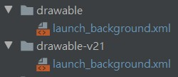

# Buddha-APP
An APP of  Buddhism for Spread Buddhist knowledge. 

Screen Shots
<p float="left">


</p>

## 一些學習資源紀錄
1. [Flutter 修改应用名称、图标、启动页](https://blog.csdn.net/yechaoa/article/details/98958344)
教學待寫

2. [Git Commit Message 這樣寫會更好，替專案引入規範與範例](https://wadehuanglearning.blogspot.com/2019/05/commit-commit-commit-why-what-commit.html)

3. Git永久删除文件(包括历史记录)

    ```bash
    git filter-branch --force --index-filter 'git rm --cached --ignore-unmatch path-to-your-remove-file' --prune-empty --tag-name-filter cat -- --all
    ```

    link : 

    https://gist.github.com/3b295/ac01498cfdc76c732e473c3756ed6bb2
    https://www.cnblogs.com/shines77/p/3460274.html

4. git push 卡住

    解決方式：
    添加sendpack.sideband属性并置为false
    ```
    全局的：git config –global sendpack.sideband false
    仓库的：git config –local sendpack.sideband false
    ```

    link : https://blog.csdn.net/wangliyao518/article/details/84237016

## 一些踩雷紀錄
### 1. 修改啟動頁面Logo的時候，若drawable資料夾有好幾個，就都要改。因為會有數個不同的相容性版本使用 [Link](https://stackoverflow.com/questions/47093515/drawable-v21-v24-what-is-it)


### 2. 啟動頁白天黑夜模式顏色更改

### 3. 函式作為參數傳入widget
要設定為 final VoidCallback changeBoolState; 再傳入跟呼叫
[Pass method as parameter to a widget](https://stackoverflow.com/questions/54493002/pass-method-as-parameter-to-a-widget)

### 4. 系統字體影響 APP 文字大小 - 解決方法:
[How to make Flutter app font size independent from device settings?](https://stackoverflow.com/questions/59143443/how-to-make-flutter-app-font-size-independent-from-device-settings)


### 5. Can't use MediaQuery with the builder parameter of MaterialApp in flutter's new versions
[Link](https://stackoverflow.com/questions/67751639/cant-use-mediaquery-with-the-builder-parameter-of-materialapp-in-flutters-new)

### 6. 上架 PlayStore 錯誤 : 版本代碼 1 已經使用過了,請使用其他版本代碼。
解決 : pubspec.yaml 的 version 後面要加上加號跟數字，如 0.1.3+2 
說明 : 
* 'XYZ+n' 這裡的 'xyz' 代表版本名稱，'n'代表版本編號 
    * 版本名稱是給人看的 (versionName)
    * 版本編號是給 PlayStore 辨識用，每次更新記得加 1 (versionCode)
參考資料 : 
[Flutter: upgrade the version code for play store](https://stackoverflow.com/questions/53570575/flutter-upgrade-the-version-code-for-play-store)
[自動產生 VersionCode 與 VersionName](https://louis383.medium.com/%E8%87%AA%E5%8B%95%E7%94%A2%E7%94%9F-versioncode-%E8%88%87-versionname-cb6039152b1f)

### 7. 解決在 StatefulWidget 中，state 區塊中非 build 之下，用 widget.$VAR 取用傳入 statefulWidget 建構子的值，出現 The instance member 'widget' can't be accessed in an initializer.
變數前加上 late 即可。
```dart
class _BottomNavigatorState extends State<BottomNavigator> {
  late int _currentIndex = widget.index; //重要
}
```
[參考連結](https://stackoverflow.com/questions/64092241/the-instance-member-widget-cant-be-accessed-in-an-initializer?rq=1)

### 8. Playstore error: App Bundle contains native code, and you've not uploaded debug symbols
解決方式 : 

到 [YOUR_PROJECT]\build\app\intermediates\merged_native_libs\release\out\lib 目錄下
有 3 個資料夾 : 
    * arm64-v8a
    * armeabi-v7a
    * x86_64
壓縮這三個資料夾成一個 ZIP 檔案作為符號文件，並在上傳完 aab 檔案後同時上傳此壓縮檔。
[參考連結](https://stackoverflow.com/questions/62568757/playstore-error-app-bundle-contains-native-code-and-youve-not-uploaded-debug)


### 9. 每次上傳前要做的事情
1. 更新版本代碼
2. 壓縮符號文件並上傳


## TODO
[V] 啟動logo要換高畫質的

## 隱私權文件
[教學 : 產生 App 上架需要的隱私權政策 URL](https://medium.com/%E5%BD%BC%E5%BE%97%E6%BD%98%E7%9A%84-swift-ios-app-%E9%96%8B%E7%99%BC%E5%95%8F%E9%A1%8C%E8%A7%A3%E7%AD%94%E9%9B%86/%E7%94%A2%E7%94%9F-app-%E4%B8%8A%E6%9E%B6%E9%9C%80%E8%A6%81%E7%9A%84%E9%9A%B1%E7%A7%81%E6%AC%8A%E6%94%BF%E7%AD%96-url-7bc4746cf75d)
[隱私權政策產生器1-privacyPolicies](https://app.privacypolicies.com/)
[隱私權政策產生器2](https://app-privacy-policy-generator.firebaseapp.com/)

## 程式架構
* main
    * wrapper (帳密相關尚未實作)
        * home
            * bottomNavigator (共用頁面)
                * pray scaffold (pray)
                    * CommonHeader
                    * PrayContext
                        * WidgetBeforePray (抽籤前介紹頁面)
                        * WidgetAfterPray
                            * FoldingPoem
                                * _buildFrontWidget (摺起來的簽)
                                * _buildInnerWidget (內部資料)
                * latestNewsScaffold
                    * CommonHeader
                    * body
                * donateScaffold
                    * CommonHeader
                    * body
                * tempScaffold
                    * CommonHeader
                    * body
